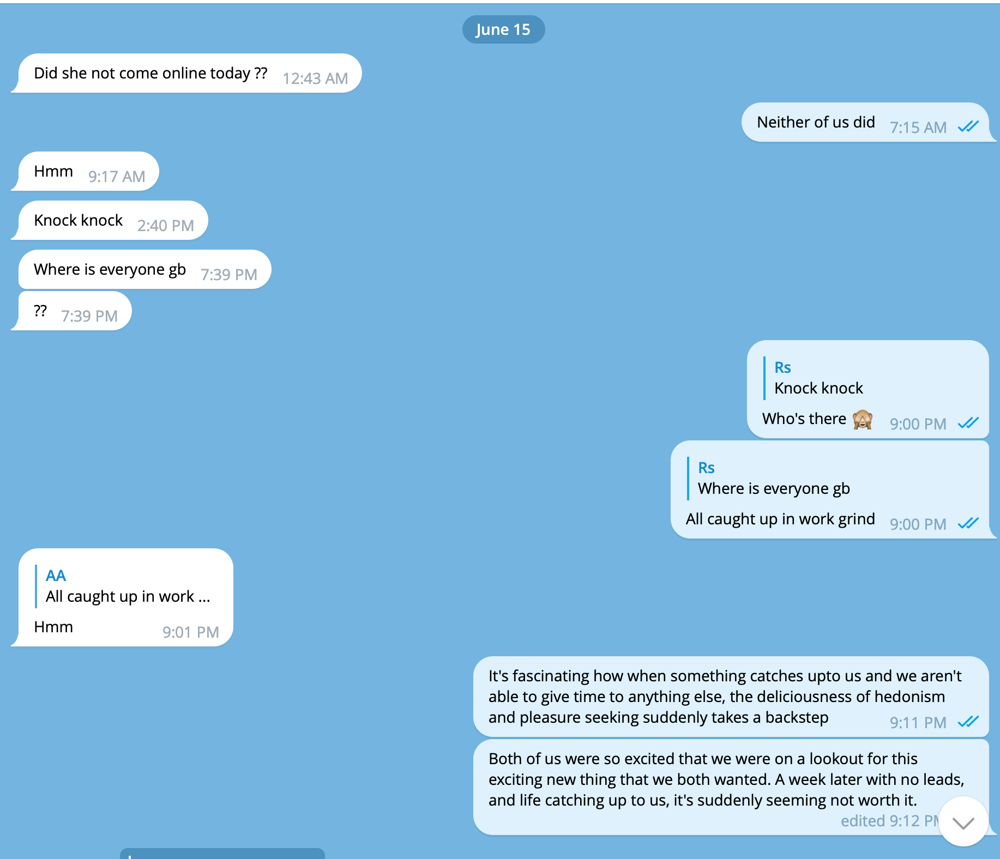
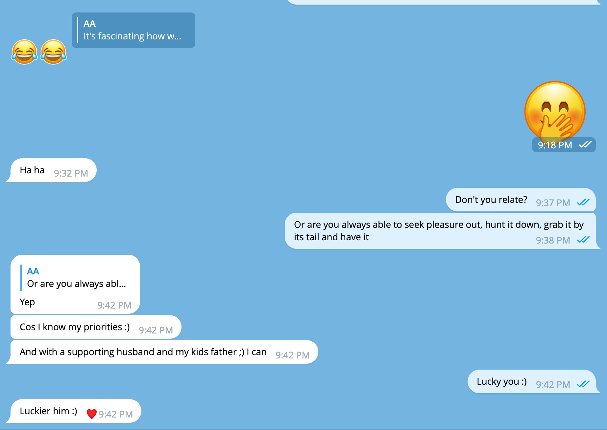

- In the forays of pursuing prurient desires, I made an online dating account with my girlfriend
- My girlfriend and I ( or me and my girlfriend? I can never tell) decided unanimously, that since she's bicurious and I've a fantasy to try FFM threesome, we'd go out there and search for any bi/bicurious/straight woman who would want to give us a chance to make them feel comfortable around and with us, and if that, to share our love, throbs, orgasms and squirts and give into the night with us.
- We found a woman who got really interested in her.
- I talked to that woman as my girlfriend through the dating account, and she couldn't catch a hint. I think it has more to do with my writing skills and knowing women better than most men than anything else, but anyway. I think this sentence was self praise, haha. But seriously though, if I can do it, any men can. I didn't have bad intentions to mansplain or persuade her to share things with me, but it's highly possible people with my writing skills and bad intentions can. Always, always, talk with the person over a call or phone, or if you've moved to a messaging app like telegram or signal, ask for a voice recording. You could even try relying on the online dating verification feature. But who knows where that technology can falter, there are always creative people who find ways to go around it.
- 39 years of age, she said her life turned upside down for good, when her husband introduced her to *this world*. By that she meant seeking pleasure out in the world above anything else. She praised and blessed and thanked her husband for having done it himself before marriage and for being so full hearted and compassionate as to have motivated her to meet other people and go wild. While this is a wonderful thing to do — be so open-minded, which 99% of the men in the world couldn't reach at, because of orthodoxical, patriarchal, possessive upbringing and ingrained thought processes, towards the end of the second day of talking with her ( as myself as well in the end for some hours ), I realised how disturbing their priorities felt to me, despite being an on and off hedonist.
- Her first wild step, when her husband first confessed of his lifestyle choices and encouraged her to seek the same out, was a night where she fucked and got fucked by 4 men. She remembers and tells about it very fondly. But she couldn't use a lot of adjectives in how she feels doing all this, other than 'nice' or 'amazing.' She then went onto sharing a couple of videos
	- She was getting fucked by her french boyfriend in missionary position. It seemed like purely animalistic sex. No granular intimacy in sight. An exchange, a transaction. But a sexy and wild one nonetheless.
	- Getting fucked by her husband in a doggie while she gave fellatio to her french boyfriend.
- Up until this time I'd been talking as my girlfriend. She kept wanting to meet with her or talk with her, despite our telling that we didn't want to explore it with a couple. She was really turned on by my girlfriend.
- She has a 10 year old kid. And said that she's only able to do what she does because her husband takes care of the kid, because he cares about pleasure, of me wanting to go out to seek it and grab it.
- Both of them have been doing this ( together ) for about 10 years.
- My girlfriend talked to her as her for a bit, in which the woman made clear that what she wanted out of her — to meet with her ( so that – I suppose – she could woo her for a girl on girl action ). It didn't dwell well with m girlfriend. At which point the woman stopped her flirtations and ended with:
  
  > Sure love, your choice.
- Both of us were put off by her one pointed intention and attention to get to fuck. In a day's worth of conversation, there was not one concerned, even if superficial, message from her asking how she/we/I were doing and what was going on with us. Although her clarity of what she wanted was commendable and appreciated, it felt distended, gave us a feeling of conflict. The feeling of conflict arose because we couldn't think of being so hot and bothered throughout the day and throughout the night so as to be on a lookout for pleasure almost ***all the time***.
- The day after, in the night I talked with her for a bit as myself. She wasn't interested the way she was with my girlfriend. When I started talking to her as myself, she asked about "my story". I asked what kind of story, she said on the lines of 
  
  > I'm not interested in any other kind, or your life wink wink
  
  As I started talking, and as I started telling her about what me and my girlfriend so, how I met with her, writing clearer sentences, wooing her with
  
  > _She told me you sent her some really steamy videos of you with other people, I long to see that_,
  
  she started opening up a bit. To this she replied _in time_. But ended up sharing those videos when I shared a couple of my girlfriend's. We had become comfortable enough to be able to do that, but I was curious to see if she'd turn her _in time_ to _you gave me her to see her again, here you go, prize for your service to me_. She did exactly that. She said
  
  > I told you I like to get what I like 😉, for that I'll reciprocate.
- She asked to see me in a video as well after, I'd say, a little half heartedly. When I shared, she first shared disappointment that it wasn't a video. But then she sent me a couple of pictures herself saying _I deserved it_. In the photographs, she was sucking her husband's penis and a 23 year submissive girl licked her pussy, in what looked like the sub's apartment. One makeshift cot mattress on the floor without a bed sheet, in the living room of a dingy dirty flat. ( the ones with her french boyfriend were in a world class hotel suite )
- She asked me my dirtiest kink or fantasy. I told her about how it turns me on when I involuntarily drool over my girlfriend's face as we are fucking and she doesn't wipe it seeing that I get turned on by it and fuck her harder. I used a little sneaky by spicy language to express this. She:
  > I didn't understand a thing there 🤣. Could you use easier words Mr. writer.
  
  I asked her hers. She told about the time when they had fucked buck naked on a beach in Andaman with no concerns for passersby — some of whom came close to touch and fondle — which excited her immensely.
- After a while of having shared mine, she finally complemented me, as if as a favour or pity.
  
  > The football was a nice touch.
- When I had shared my relationship with my girlfriend, she longed for us in that
  > We seek out couples like you. Normally we mostly find couples who are bored with each other and want to try us out as an escape hatch to feel pleasure. But we want to meet with people like you who have good going with each other and who — after swapping with us — would have heightened sense of pleasure for each other as well in terms of kinks explored, and talking about it in the future and seeking more.
- Going away for the night, she brought me into disappearing telegram chat and asked me if I had been with other women unbeknownst to my girlfriend. I told her I had been but that I had to herabout them later. Then she advised
  
  > Don't be afraid to not tell her if it comes in between you and your pleasure. Life's too short to be thinking a lot about this. Wanted to say this that's why I brought you in the disappearing chat. I've boyfriends all across the world 😉
  
  A true hedonist.
  
  Before she left she sent me another video saying I deserved it, of her riding her french boyfriend. She said she was now ( at 2am ) going to wake her husband up, and rape him ( in most lascivious consensual non-consent of good intentions ), and that she already had her vibrator going on her imagining my girlfriend.
- The next day:
  
  
- I don't know where does this leave me in my own battle with constantly seeking pleasure and stretch the limits of the desires of my mind, which is always hungry for me, and my tiredness of it, in cycles, again and again, again and again.